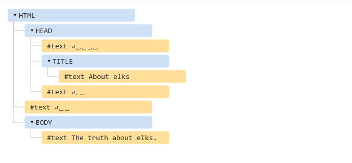
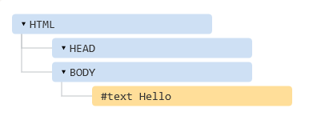
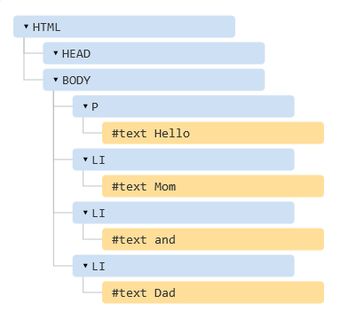

## DOM tree

* The backbone of an HTML document is tags.

* According to Document Object Model (DOM), every HTML-tag is an object. Nested tags are called “children” of the enclosing one.

* All these objects are accessible using JavaScript.

## An example of DOM

For instance, let’s explore the DOM for this document:

```JavaScript
<!DOCTYPE HTML>
<html>
<head>
  <title>About elks</title>
</head>
<body>
  The truth about elks.
</body>
</html>
```

The DOM represents HTML as a tree structure of tags. Here’s how it looks:

<p align="center">
  
</p>

* Tags are called element nodes (or just elements).

* Nested tags become children of the enclosing ones.

* **<html>** is at the root, then **<head>** and **<body>** are its children etc.

* The text inside elements forms text nodes, labelled as `#text`.

Please note the special characters in text nodes:

* a newline: `↵` (in JavaScript known as `\n`)
* a space: `␣`

## Autocorrection

If the browser encounters malformed HTML, it automatically corrects it when making DOM.

* For instance, the top tag is always `<html>`, even if it doesn’t exist in the document – it will be in DOM tree.

* The browser will create it. The same about `<body>`.

As an example, for this **hello.html**:

```html
Hello
```

The DOM tree will be:

<p align="center" style="margin-top:25px">
  
</p>

* While generating DOM, browser automatically:
  - Processes errors in the document.
  - Closes tags and so on.

Such an “invalid” document:

```html
<p>Hello
<li>Mom
<li>and
<li>Dad
```

becomes:

<p align="center" style="margin-top:25px">
  
</p>

## Summary

An HTML/XML document is represented inside the browser as the DOM tree.

* Tags become element nodes and form the structure.

* Text becomes text nodes.

* …etc, everything in HTML has its place in DOM, even comments.

We can use developer tools to inspect DOM and modify it manually.

## Exercises

1. Play with the **DOM** using **google dev tools**.

* Open your favorite website using google chrome.
* Then, open the chrome dev tools.
* Try to modify some DOM elements.
* Try to remove some DOM elements.

2. On a sheet of paper draw the DOM tree for the following `HTML`

```html
<html>
  <head>
    <meta charset="utf-8">
    <title>the dom tree</title>
  </head>
  <body>
    <header>
      <h1>walking through the dom</h1>
    </header>
    <main>
      <article>
        <p>dom stuff</p>
      <article>
      <aside>
        
      </aside>
    </main>
  </bdoy>
</html>
```
