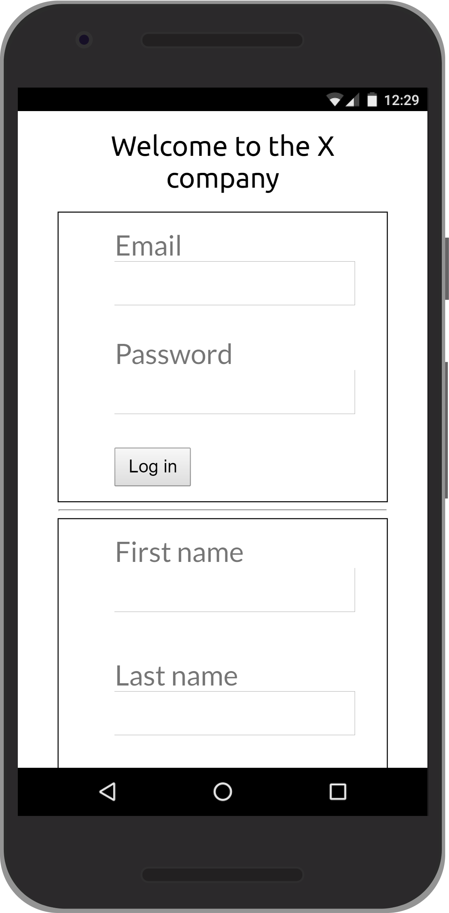
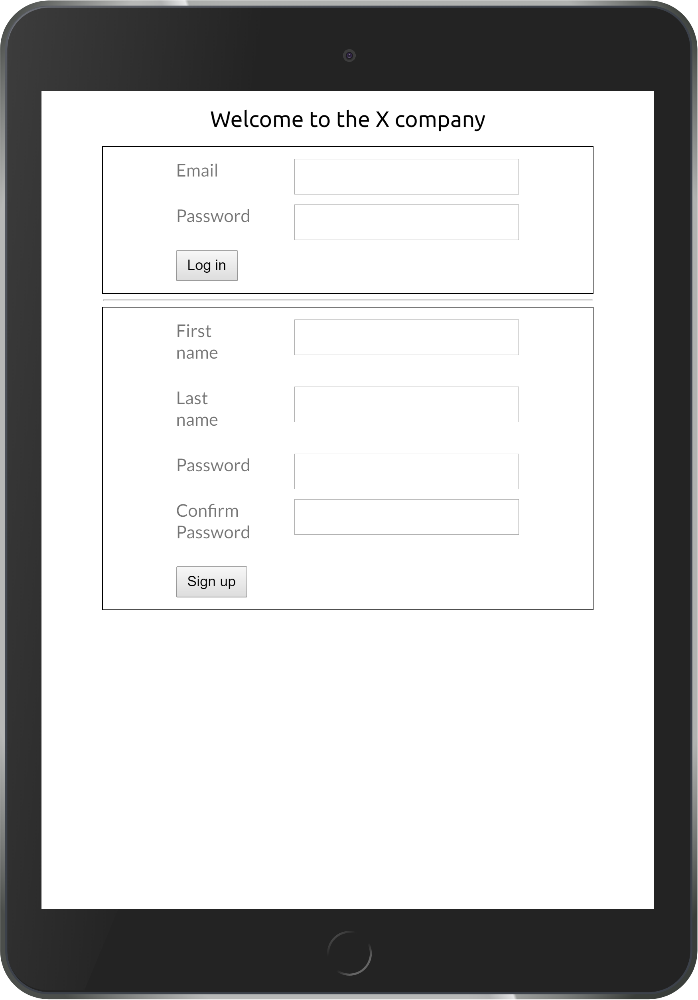
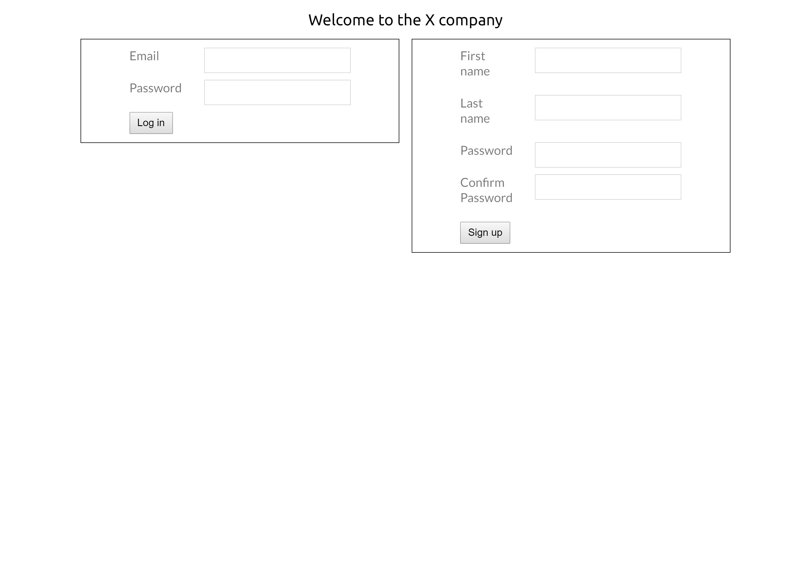

# Project 2: Form / Sign up page

The objectives of this project is to

1. Apply your html/css/javascript skills in real settings
2. Learn and apply form validation technics
3. Learn and apply responsive design technics

## Porject output

### 1. On phone

  

### 2. On tablet

  

### 3. On laptop

  

## Form validation

### 1. login form

* `email` field is required and of type email.
* `password` field is required and of type password and:
  - Should be at least 8 characters.
  - Should be at most 30 characters.
  - Should have at least on upper case character.
  - Should have one numeric character.
  - Should have one of the following symbols ['+','-','*','/','!','#'].

### 2. Sign up form

* `email` field is required and of type email.

* `first name`, `last name`  fields are required and of type text and:
  - At least 5 characters.
  - At most 15 characters.
  - Only alphabetic characters.

* `password` same as login form and check that password confirm.
