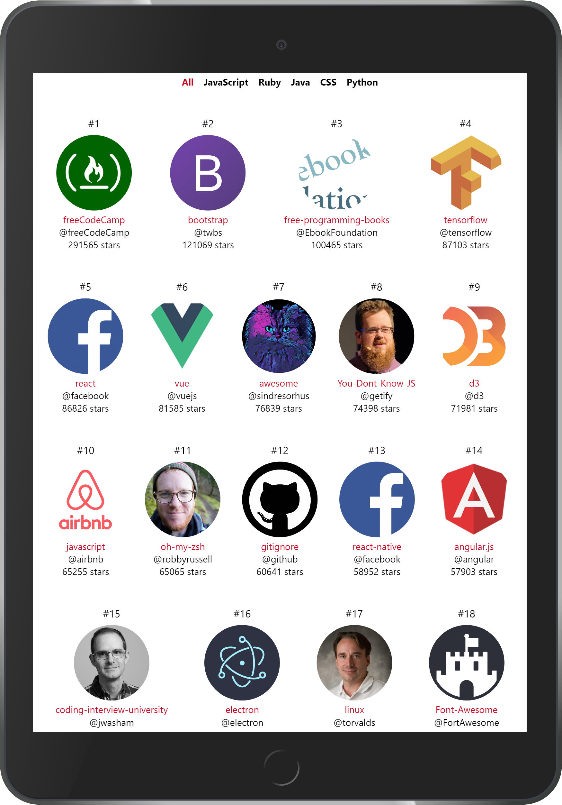
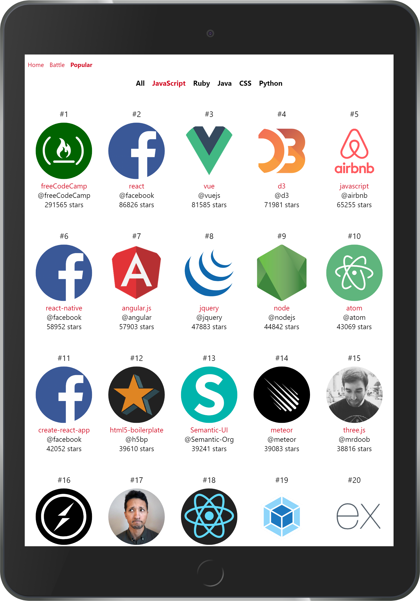
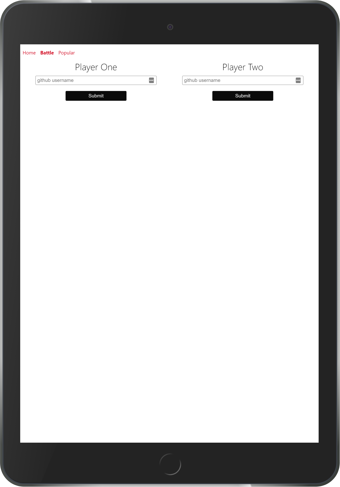
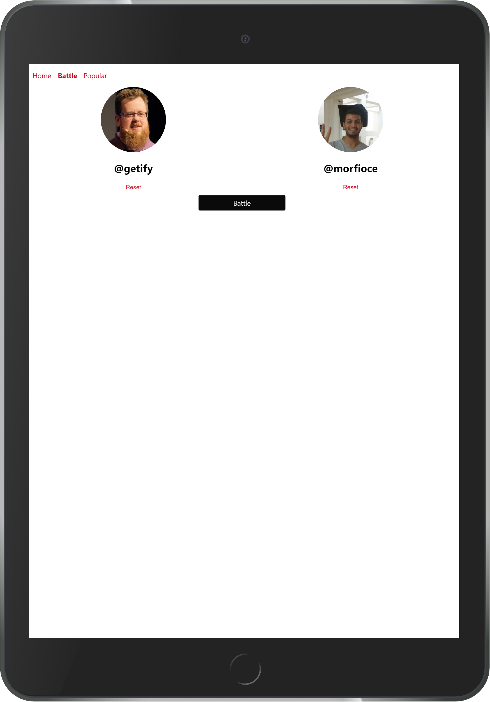
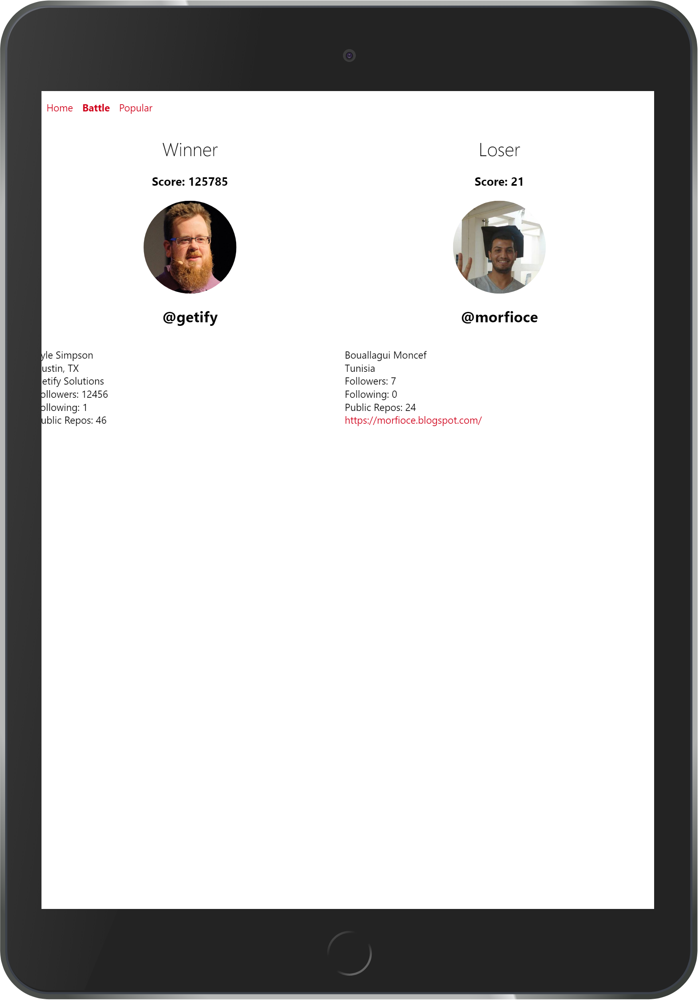

# Project - Build a github project explorer

In this project your task is to build a github project explorer using github API.

## Learning objectives:

* Apply your HTML/CSS/JS in a real project.
* Use jQuery to request data across network.
* Use jQuery to inject content into a web page.
* Practice writing asynchronous functions and get familiar with callbacks.

## Part I - Most popular

### Screeshots

**Most popular repositories across all languages.**

  

**Most popular JavaScript repositories.**

  

### User stories

1. User should be able to see a centered menu that display different languages (All / JavaScript / Python / Go / Ocaml / Scala)

1. User can see the 30 most popular github repositories by default accross all languages (popular according to the number of stars)

2. User can click on a language to see the 30 most popular repositories in that language.

## Part II - Github battle

### Screeshots

**Battle forms.**

  

**Showing github profiles for the warriors.**

  

**Showing the battle result.**

  

### User stories

1. User can navigate to the **battle** page from the top navigation menu.

1. After navigating to the **battle** page user should be able to enter the usernames (github usernames) and select two users for the battle.

2. After selecting two github users for the battle, user can click on a **Battle** button to see the winner.

Winner formula

**user score = (num of follower * 3) + (the sum of number of starts of all user repositories)**
